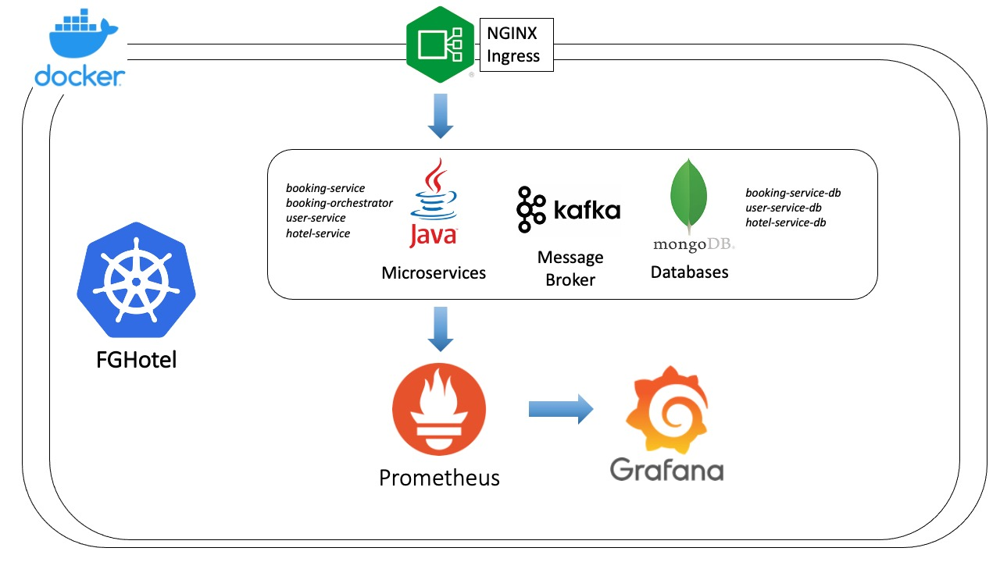
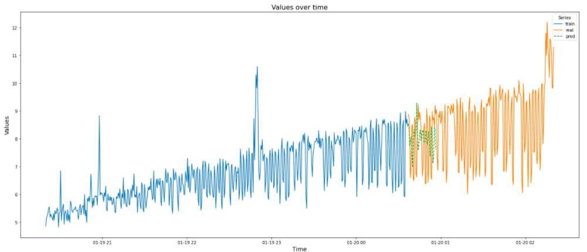
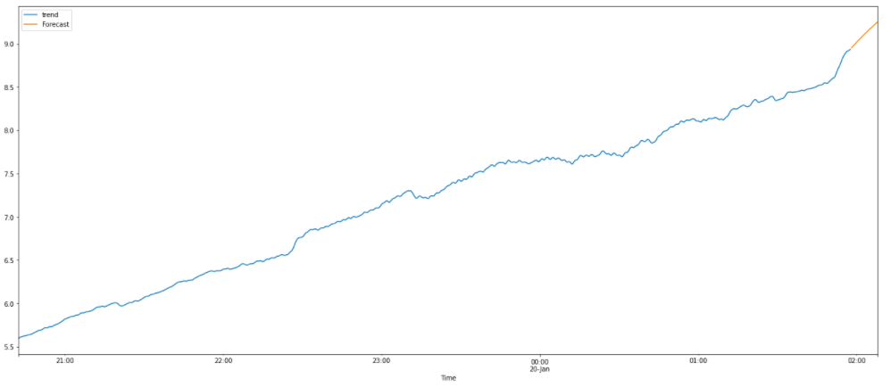
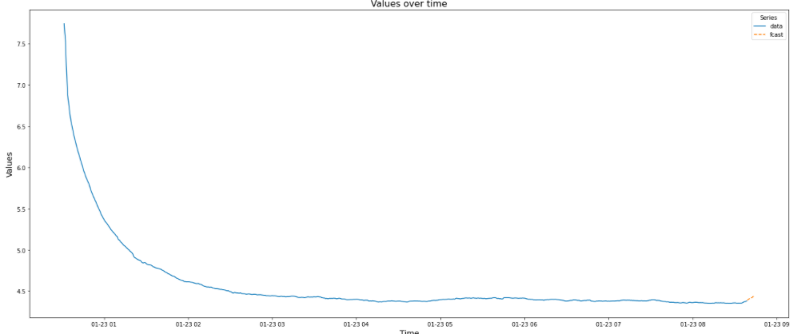

# FGHotel

## Descrizione
Il progetto prevede un sistema di prenotazione di stanze all'interno di hotel.
L'utente prima di effettuare una qualsiasi prenotazione deve procedere con la registrazione (user-service), inserendo informazioni personali quali:
- nome
- cognome
- indirizzo
- n_telefono

Il model di hotel-service comprende:
- nome
- id
- lista di stanze

La comunicazione tra i microservizi avviene sfruttando Kafka
Il microservizio responsabile della registrazione utente è lo user-service, che inserisce le informazioni all'interno del proprio database assegnandogli un identificativo.
Altro microservizio è l'hotel service, responsabile della gestione degli hotel.
Il microservizio si occupa di inserire nuovi hotel all'interno del proprio database con il rispettivo nome e numero di stanze. Per ogni stanza, all'atto della prenotazione, verrà verificato lo stato della stanza per la data richiesta.
Infine vi è il microservizio del booking-service che si occupa di creare le prenotazioni e impostare lo stato delle prenotazioni a confermato o cancellato.
I microservizi in questione possono essere schematizzati come segue: 

Il processo di prenotazione della camera richiede due step: lo user-id indicato in fase di prenotazione deve essere già registrato, così come l'hotel-id. Tuttavia, per prenotare una stanza bisogna verificare se la stanza richiesta è disponibile per la data di prenotazione richiesta. Siamo così in presenza di una saga che gestiamo tramite orchestrator(booking-orchestrator).
Sono presenti quindi quattro microservizi:

-booking-service

-booking-orchestrator

-hotel-service

-user-service

Il microservizio hotel-service prevede la possibilità di effettuare il checkout per una determinata prenotazione: in tal caso richiede le informazioni della prenotazione al booking -service attraverso kafka. Nel caso in cui la prenotazione sia in uno stato di confirmed, l'hotel invia un messaggio attraverso kafka a un billing-service (non implementato) per la fatturazione.

## Saga
La saga è così costituita:
1. il booking-orchestrator richiede allo user-service se l'id è disponibile:
CASO DI SUCCESSO: si passa allo step successivo, ovvero si verifica la disponibilità della camera e l'esistenza dell'hotel.
CASO DI INSUCCESSO: la booking passa nello stato di DELETED.
2. hotel-service verifica l'esistenza dell'id hotel e la disponibilità della stanza:
CASO DI SUCCESSO: la prenotazione viene confermata.
CASO DI INSUCCESSO: la prenotazione passa nello stato di DELETED.

I microservizi agiscono dietro INGRESS che si occupa di smistare le richieste tra i vari micro-services.
## Whitebox monitoring
Come sistema di monitoraggio è stato utilizzato PROMETHEUS per il whitebox monitoring dove le metriche analizzate sono state: 

- booking creati totali (implementato tramite un counter che viene incrementato ogni qualvolta arriva una richiesta di prenotazione). In tale prospettiva sono stati inseriti ulteriori due counter (deleted e confirmed) che ogni qualvolta si ha l'esito del processo di prenotazione vengono incrementati.
- container_cpu_load_average_10s
- response time delle richieste di prenotazione (implementato tramite un timer avviato dal booking-service all'atto di ricezione della richiesta di prenotazione e stoppato quando viene ricevuta una risposta dall'orchestrator.

Sono stati creati degli alert per notificare tramite mail il verificarsi di particolari condizioni, per esempio memoriadisponibile/memoriatotale * 100< 10, immaginando una situazione in cui la memoria sta per saturarsi.

## Previsioni
### Prima metrica
La metrica che andiamo ad analizzare è booking_created_total inserita all'interno di booking-service. Tale metrica viene incrementata ogni qualvolta il microservizio in questione crea una nuova prenotazione. Abbiamo creato uno script in python che invia delle richieste al microservizio, incrementando così il contatore ed eseguendolo per circa 6 ore. Lo script creato invia delle curl al microservizio con una frequenza variabile. Viene estratto il numero medio di richieste al minuto.
Il grafico estratto tramite Grafana è il seguente:

Inizialmente abbiamo analizzato la nostra time series, attraverso la funzione seasonal_decompose, allo scopo di vedere il trend,seasonability e error, variandone i parametri model e period. Tra i due modelli (add,mul) il modello additivo è risultato essere il più accurato. Variandone il periodo invece, si nota come il modello è difficile da predirre in quanto quando viene determinata una decomposizione della curva, si riesce ad avere un trend abbastanza chiaro, ma non si riescono a ridurre i residui e a trovare la giusta stagionalità. 

Andiamo a splittare i valori del trend in 90% e 10% rispettivamente per il train e test. Andiamo a utilizzare l'AR provando diversi valori di lag: con valore lag=6-7 vi è un match con il primo pezzetto della curva, ma successivamente le curve hanno andamento differente.

Passiamo quindi alla valutazione tramite ARIMA. Lavoriamo col trend per le motivazioni esposte sopra.
Utilizziamo quindi autoarima per conoscere i valori p,q,d ottimali: nel nostro caso 3,1,3. Facciamo il fit del model sul training set e notiamo come vi sia un match con la curva del trend.

Calcoliamo l'mean_squared_error e l'rmse rispettivamente di 6.75538324410797 e 2.5991120106890295, molto inferiori rispetto alla std della curva pari a 108.203903. Eseguiamo quindi il fit del model sull'intero trend e facciamo il forecast dei dati futuri.

### Seconda metrica
La seconda metrica analizzata è la CPU utilizzata durante l'invio delle curl per incrementare il valore di booking_created_total. Il grafico estratto tramite Grafana è il seguente:

Inizialmente andiamo a utilizzare la funzione seasonal_decompose per decomporre la curva in trend, seasonability e errore. Con un periodo pari a 45 si nota che gli errori tendono ad avere un valore medio quasi nullo e si nota più chiaramente seasonability:

Stavolta proviamo il metodo Holt-Winters. Perciò splittiamo i dati in training e test e utilizziamo la funzione ExponentialSmoothing sui dati di train per valutare il modello, variando sia la tipologia di  trend, sia la tipologia di seasonability. 
Sono state effettuate delle prove variando anche il periodo: il migliore risultato si ottiene con valore 150 e trend e seasonability='add' (purchè è comunque un risultato scadente). 

Utilizziamo il modello AR, ma con risultati pressochè negativi. Perciò come nel precedente caso, ci concentriamo sul trend. Utilizziamo autoarima per valutare i valori da inserire su order nella funzione ARIMA (in questo caso 5,1,5). Applicando la funzione prima sui dati di training e poi sull'intero set di dati, si ottiene una predizione del trend accettabile, come mostrato in figura:

Valutiamo l'errore mean_squared_error e rmse pari rispettivamente a 0.01568698809548963 e 0.12524770694703208, inferiore alla std pari a 0.881364 
Successivamente facciamo il forecast per i valori futuri:

### Terza metrica

L'ultima metrica analizzata è il response time implementato tramite un timer avviato dal booking-service all'atto di ricezione della richiesta di prenotazione e stoppato quando viene ricevuta una risposta dall'orchestrator. La metrica è la seguente:

Abbiamo analizzato la funzione tramite seasonal_decompose. 

Per la metrica in questione abbiamo utilizzato il metodo Holt-Winters per effettuare le predizioni:
così come nei casi precedenti splittiamo i dati in train e test, tuttavia dato che la prima richiesta ha un response time alto, prendiamo i dati a partire dal 250esimo campione, ovvero quando il rate comincia ad assestarsi.

Abbiamo variato il seasonal_periods, calcolandone l'errore rispetto ai dati di test. I risultati mostrano come la previsione con seasonal_period=197 sia la migliore, riscontrando un errore di 0.03824938802, migliore rispetto alla standard deviation dell'intera curva. 

Abbiamo inoltre utilizzato la funzione auto_arima allo scopo predirre il trend. Valutiamo il modello sul test set:

Applichiamo il modello all'intero set di dati  e successivamente facciamo il forecast dei valori futuri.

 

# Comandi 
>minikube start --cpus=4 --driver=docker --memory=4096mb
>
>eval $(minikube docker-env)
>
>minikube addons enable ingress
>
>docker build -t booking-service:v1 /home/alessio/IdeaProjects/FGHotel2/booking-service
>
>docker build -t booking-orchestrator:v1 /home/alessio/IdeaProjects/FGHotel2/booking-orchestrator
>
>docker build -t user-service:v1 /home/alessio/IdeaProjects/FGHotel2/user-service
>
>docker build -t hotel-service:v1 /home/alessio/IdeaProjects/FGHotel2/hotel-service
>
>kubectl apply -f /home/alessio/IdeaProjects/FGHotel2/k8s/
>
>echo "$(minikube ip) fghotel.dsbd.loc." | sudo tee -a /etc/hosts

### Grafana e Prometheus

>kubectl create ns monitoring
>
>helm repo add prometheus-community https://prometheus-community.github.io/helm-charts
>
>helm install prometheus prometheus-community/kube-prometheus-stack -n monitoring 
>
>kubectl port-forward -n monitoring pod/prometheus-prometheus-kube-prometheus-prometheus-0  9090
>
>kubectl port-forward -n monitoring service/prometheus-grafana 3100:80

### Alert

>helm upgrade -f values.yaml prometheus -n monitoring  prometheus-community/kube-prometheus-stack
